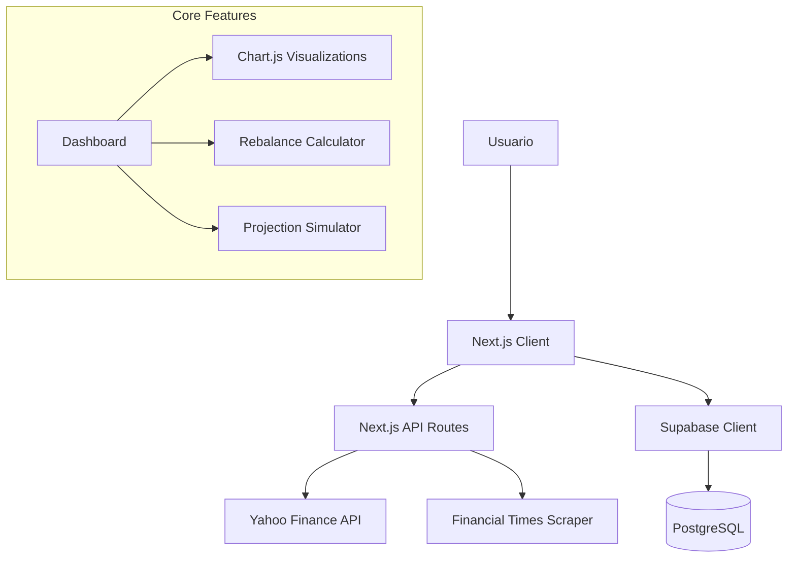

# 📚 Documentación Técnica - Indx.ai

Documentación completa para desarrolladores y contribuidores del proyecto Indx.ai.

---

## 📋 Tabla de Contenidos

1. [Arquitectura del Sistema](#arquitectura-del-sistema)
2. [Stack Tecnológico](#stack-tecnológico)
3. [Guía de Desarrollo](#guia-de-desarrollo)
4. [Estructura del Proyecto](#estructura-del-proyecto)
5. [Funcionalidades Avanzadas](#funcionalidades-avanzadas)
6. [Integración con APIs](#integración-con-apis)
7. [Base de Datos y Persistencia](#base-de-datos-y-persistencia)
8. [Testing y Debugging](#testing-y-debugging)

---

## 🏗️ Arquitectura del Sistema

**Indx.ai** es un dashboard de inversiones construido con Next.js que permite a los usuarios:
- Gestionar su cartera de fondos indexados y ETFs.
- Visualizar rentabilidad en tiempo real (P&L, XIRR).
- Analizar distribución de activos y rebalanceo automático.
- Proyectar crecimiento futuro con simulaciones de interés compuesto.

### Componentes Principales



---

## 🛠️ Stack Tecnológico

### Core
- **Framework**: Next.js 15 (App Router)
- **Lenguaje**: TypeScript 5.7+
- **React**: 18+ con Hooks Avanzados (`useMemo`, `useCallback`)

### Estilos y UI
- **CSS Framework**: Tailwind CSS 3.4
- **Estilos Personalizados**: CSS Modules + `globals.css` (Variables CSS)
- **Tema**: Dark Mode Premium (`#0b1121`) con paleta financiera profesional.
- **Componentes UI**: Botones, Modales, Sliders personalizados.

### Visualización de Datos
- **Gráficos**: Chart.js 4 + react-chartjs-2
- **Tipos de gráficos**:
  - Línea (Evolución P&L vs Benchmark)
  - Dona (Distribución de Activos)
  - Área (Proyección de Interés Compuesto)

### Estado y Datos
- **Gestión de Estado**: React Context API (`InvestmentContext`)
- **Persistencia Híbrida**: 
  - `localStorage` (Caché offline)
  - **Supabase** (Persistencia en nube: auth, portfolio, settings)

---

## 🚀 Guía de Desarrollo

### Instalación
```bash
npm install
```

### Ejecutar Servidor Local
```bash
npm run dev
# Acceder a http://localhost:3000
```

### Linting
```bash
npm run lint
```

### Base de Datos (Supabase)
Requiere configurar `.env.local`:
```env
NEXT_PUBLIC_SUPABASE_URL=https://tu-proyecto.supabase.co
NEXT_PUBLIC_SUPABASE_ANON_KEY=tu-anon-key
```

---

## 📁 Estructura del Proyecto

```
Indx.ai/
├── src/
│   ├── app/                    # Next.js App Router
│   │   ├── api/                # API Routes (Proxy a servicios externos)
│   │   ├── layout.tsx          # Layout raíz con Providers
│   │   ├── page.tsx            # Dashboard Principal
│   │   └── globals.css         # Estilos globales y temas
│   │
│   ├── components/             # Componentes React
│   │   ├── auth/               # Login/Registro
│   │   ├── ChartsSection.tsx          # Gráficas principales
│   │   ├── HistorySection.tsx         # Histórico con Benchmarking
│   │   ├── RebalanceCalculator.tsx    # Herramienta de Rebalanceo
│   │   ├── ProjectionSimulator.tsx    # Simulador de Interés Compuesto
│   │   └── PortfolioSummary.tsx       # Tarjetas de resumen (XIRR, Valor)
│   │
│   ├── context/                # Estado Global
│   │   ├── InvestmentContext.tsx      # Lógica de negocio principal
│   │   └── AuthContext.tsx            # Sesión de usuario
│   │
│   ├── hooks/                  # Custom Hooks
│   │   └── usePortfolioHistory.ts     # Generador de series temporales
│   │
│   ├── lib/                    # Utilidades
│   │   ├── calculations.ts     # Algoritmos financieros (XIRR, CAGR)
│   │   ├── supabaseStorage.ts  # Capa de datos Supabase
│   │   └── priceService.ts     # Fetchers de precios
```

---

## 🧠 Funcionalidades Avanzadas

### 1. Rentabilidad Real (XIRR)
Calcula la **Tasa Interna de Retorno (TIR)** usando el método de Newton-Raphson para flujos de caja irregulares.
- **Ubicación**: `src/lib/calculations.ts`
- **Uso**: Permite conocer el rendimiento real anualizado considerando el "timing" de las aportaciones, no solo el valor final.

### 2. Benchmarking
Compara el rendimiento de la cartera contra índices de mercado (S&P 500, MSCI World).
- **Implementación**: Normaliza las series temporales para comparar base 100 o P&L relativo.
- **Datos**: Obtiene datos históricos de Yahoo Finance (`^GSPC`, `URTH`) al vuelo.

### 3. Calculadora de Rebalanceo
Herramienta para mantener la asignación de activos deseada.
- **Persistencia**: Los "pesos objetivo" (`target_weight`) se guardan en Supabase.
- **Lógica**: Calcula la desviación entre `currentWeight` y `targetWeight` y sugiere operaciones de Compra/Venta (`diffCurrency`).
- **Batch Updates**: Soporta edición masiva de múltiples objetivos simultáneamente.

### 4. Simulador de Proyecciones
Proyecta el valor futuro de la cartera basándose en interés compuesto.
- **Inputs**: Aportación mensual, horizonte temporal (años), rentabilidad estimada.
- **Visualización**: Gráfico de área separando "Principal Invertido" vs "Intereses Generados".

---

## 📡 Integración con APIs

### Yahoo Finance (Proxy Local)
Endpoints propios para evitar CORS y estructurar datos:
- `GET /api/yahoo-search?isin=...`: Resuelve ISIN a Ticker.
- `GET /api/yahoo-history?symbol=...`: Histórico de precios ajustados.

### Financial Times (Scraping)
Extrae datos profundos de fondos no disponibles en APIs públicas gratuitas:
- Top 10 Holdings
- Distribución Sectorial y Geográfica

---

## 💾 Base de Datos y Persistencia

### Esquema Supabase (Tabla `investments`)

| Columna | Tipo | Descripción |
|---------|------|-------------|
| `id` | uuid | PK, Identificador único |
| `user_id` | uuid | FK a `auth.users` |
| `isin` | text | Identificador del activo |
| `name` | text | Nombre descriptivo |
| `shares` | numeric | Número de participaciones |
| `total_investment` | numeric | Capital invertido (€) |
| `purchase_date` | date | Fecha de compra inicial |
| `target_weight` | numeric | **Nuevo**: Peso objetivo para rebalanceo (%) |
| `created_at` | timestamptz | Fecha de creación |

### Migraciones
Para habilitar todas las funcionalidades, ejecutar en SQL Editor el archivo `supabase_schema.sql`. Si ya tienes tablas creadas, puedes añadir las columnas necesarias manualmente:
```sql
ALTER TABLE investments ADD COLUMN IF NOT EXISTS target_weight NUMERIC DEFAULT NULL;
ALTER TABLE investments ADD COLUMN IF NOT EXISTS asset_class TEXT DEFAULT NULL;
ALTER TABLE investments ADD COLUMN IF NOT EXISTS region TEXT DEFAULT NULL;
```

---

## 🧪 Testing y Debugging

### Debugging Común
- **Precios en 0**: Verificar conexión a API Yahoo o límite de peticiones.
- **Error de Guardado**: Verificar permisos RLS en Supabase o que la migración SQL se haya ejecutado (`PGRST204`).
- **Gráfica Vacía**: Revisar fechas de `purchase_date`; si es futura, no hay historial.

---

**Indx.ai Team** - *Construyendo el futuro de la gestión pasiva.*
